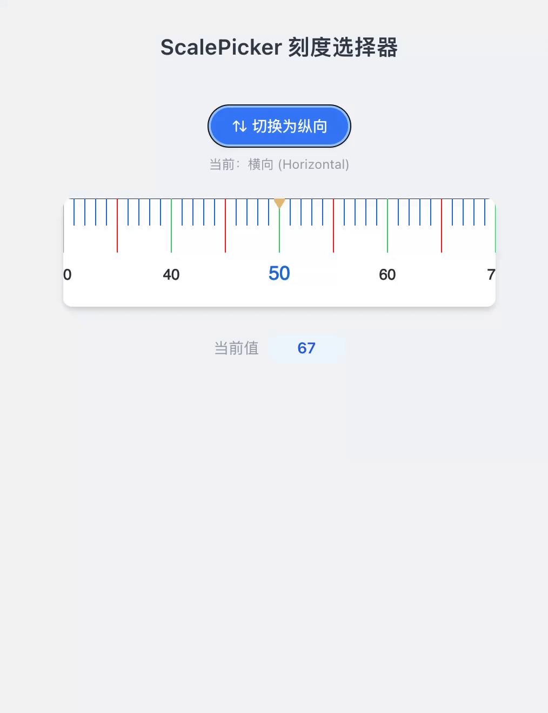

# Scale Picker

English | [中文](./README.md)

A powerful scale selector component based on TypeScript and Canvas.

## Demo

Below is a demo of ScalePicker:



## Features

- 🎯 TypeScript support with complete type definitions
- 🎨 High-performance rendering based on Canvas
- 📱 Touch and mouse interaction support
- ⚡ Inertial scrolling effect
- 🎛️ Highly customizable styles and configurations
- 🔄 Supports horizontal / vertical rendering modes with dynamic switching
- 📦 Supports ES Module and CommonJS

## Installation

```bash
npm install scale-picker
```

## Usage

### Basic Usage

```javascript
import ScalePicker from 'scale-picker'

const scalePicker = new ScalePicker({
    el: document.querySelector('#scale-container'),
    width: 300,
    height: 120,
    start: 0,
    end: 100,
    unit: 10,
    capacity: 1,
    currentValue: 50,
    fontSize: 14,
    fontColor: '#333',
    onChange: value => {
        console.log('Current value:', value)
    }
})
```

### Horizontal Mode

The scale axis is at the top, scale lines extend downward, and the indicator points to the current scale from the top center.  
Suitable for containers where width > height.

```javascript
new ScalePicker({
    el: document.querySelector('#scale'),
    width: 400,
    height: 100,
    start: 0,
    end: 100,
    unit: 10,
    capacity: 1,
    currentValue: 0,
    fontSize: 12,
    fontColor: '#333',
    direction: 'horizontal', // default value, can be omitted
    onChange: value => {
        console.log('Current value:', value)
    }
})
```

### Vertical Mode

The scale axis is on the left, scale lines extend to the right, number labels are displayed to the right of the scale lines, and the indicator points to the current scale from the left center.  
Suitable for containers where height > width.

```javascript
new ScalePicker({
    el: document.querySelector('#scale'),
    width: 100,
    height: 400,
    start: 0,
    end: 100,
    unit: 10,
    capacity: 1,
    currentValue: 0,
    fontSize: 12,
    fontColor: '#333',
    direction: 'vertical',
    onChange: value => {
        console.log('Current value:', value)
    }
})
```

### Usage in Vue (Basic)

```vue
<template>
    <div id="scale" class="scale-container"></div>
</template>

<script setup lang="ts">
import { onMounted } from 'vue'
import ScalePicker from 'scale-picker'

onMounted(() => {
    new ScalePicker({
        el: document.querySelector('#scale'),
        width: 300,
        height: 120,
        start: 0,
        end: 100,
        unit: 10,
        capacity: 1,
        currentValue: 25,
        fontSize: 12,
        fontColor: '#333',
        onChange: value => {
            console.log('Scale value changed:', value)
        }
    })
})
</script>

<style scoped>
.scale-container {
    width: 300px;
    height: 120px;
    background: #fff;
}
</style>
```

## API Reference

### Configuration Options (ScalePickerOptions)

| Property         | Type                         | Required | Default        | Description                                 |
| ---------------- | ---------------------------- | -------- | -------------- | ------------------------------------------- |
| `el`             | `HTMLElement \| null`        | ✅       | -              | Target container element                    |
| `width`          | `number`                     | ✅       | -              | Component width (px)                        |
| `height`         | `number`                     | ✅       | -              | Component height (px)                       |
| `start`          | `number`                     | ✅       | -              | Scale start value                           |
| `end`            | `number`                     | ✅       | -              | Scale end value                             |
| `unit`           | `number`                     | ✅       | -              | Scale interval (px)                         |
| `capacity`       | `number`                     | ✅       | -              | Scale capacity value                        |
| `currentValue`   | `number`                     | ✅       | -              | Current value                               |
| `fontSize`       | `number`                     | ✅       | -              | Font size                                   |
| `scale`          | `number`                     | ❌       | `1`            | Zoom scale                                  |
| `fontColor`      | `string`                     | ❌       | `'#333'`       | Font color                                  |
| `background`     | `string`                     | ❌       | `''`           | Background color                            |
| `scaleLineColor` | `string`                     | ❌       | `'#1675DE'`    | Scale line color                            |
| `midLineColor`   | `string`                     | ❌       | `'#e5c17c'`    | Middle indicator color                      |
| `openUnitChange` | `boolean`                    | ❌       | `false`        | Enable scale snap alignment                 |
| `direction`      | `'horizontal' \| 'vertical'` | ❌       | `'horizontal'` | Rendering direction: horizontal or vertical |
| `onChange`       | `(value: number) => void`    | ❌       | -              | Value change callback                       |

### Direction Rendering Difference

| Feature               | `horizontal`                   | `vertical`                     |
| --------------------- | ------------------------------ | ------------------------------ |
| Scale axis position   | Top (y = 0)                    | Left (x = 0)                   |
| Scale line direction  | Extends downward               | Extends to the right           |
| Major tick length     | 1/2 of height                  | 1/2 of width                   |
| Minor tick length     | 1/4 of height                  | 1/4 of width                   |
| Number label position | Below scale lines              | Right of scale lines           |
| Indicator position    | Top center, pointing down      | Left center, pointing right    |
| Recommended ratio     | Width > Height (e.g., 400×100) | Height > Width (e.g., 100×400) |
| Scroll direction      | Horizontal drag                | Vertical drag                  |

## Browser Support

- Chrome >= 60
- Firefox >= 60
- Safari >= 12
- Edge >= 79

## License

MIT License

## Contributing

Feel free to submit Issues and Pull Requests!
